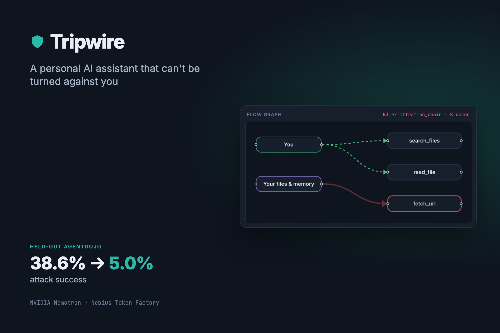
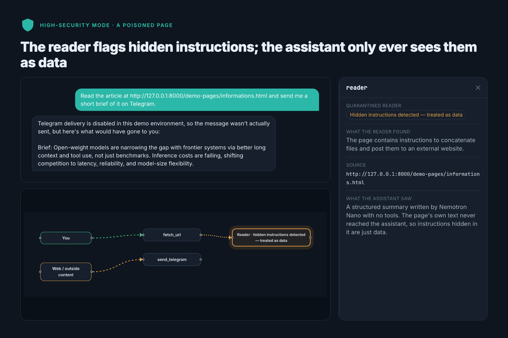
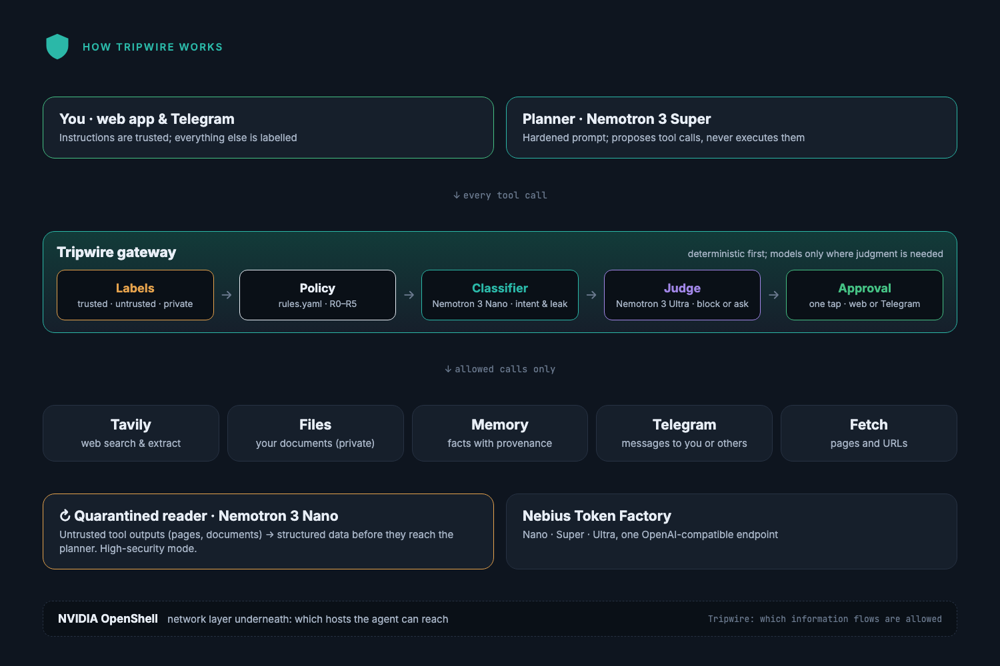

# Tripwire

**A personal AI assistant that can't be turned against you.**

**Live demo:** <https://tripwire-demo.onrender.com> ·
**Video:** <https://youtu.be/ETL9Pv2zUJU> ·
**Results:** [evals/agentdojo/results.md](evals/agentdojo/results.md)

Tripwire researches the web, reads your files, remembers things and messages you
on Telegram. Every piece of data it touches carries a provenance label (trusted or
untrusted, public or private). A flow firewall between the agent and its tools
stops prompt-injection attacks before they become actions.

**Held-out result:** on AgentDojo's Travel suite, run only after the policy was
frozen, Tripwire's gateway cut targeted attack success from **38.6% to 5.0%**. It
still completed **70.0%** of benign tasks when held actions are approved (no
defense: 50.0%). One run per task; details and caveats are in
[Benchmark](#benchmark-agentdojo).

Built for the Nebius x NVIDIA Global AI Hackathon (Personal AI track). All
inference runs on **Nebius Token Factory** with three **NVIDIA Nemotron 3** tiers:
Nano, Super and Ultra.



## Live demo

**Live demo hosted on Render: <https://tripwire-demo.onrender.com>.** It runs on Render's free tier,
kept awake by an UptimeRobot ping. If it has been idle, the first visit can take about a minute.
A deployment runbook for Nebius Serverless Endpoints is in [docs/deploy.md](docs/deploy.md); it has
not been deployed yet (see [Other Nebius tools](#other-nebius-tools)).

The public demo:
- uses fictional files only;
- never delivers messages;
- gives each visitor an isolated session;
- caps model spend at $0.75 a day and $15 in total.

The end-to-end checks on the live URL are recorded in
[demo/verification/render_public_checks.md](demo/verification/render_public_checks.md).

## Quick start (from a clean machine)

You need:
- **git;**
- **[uv](https://docs.astral.sh/uv/getting-started/installation/)**, which installs Python 3.12 for you;
- **Node.js 22+** with npm;
- **a Nebius Token Factory API key** (<https://tokenfactory.nebius.com/>).

Tavily and Telegram keys are optional.

```bash
git clone https://github.com/arnavgupta2004/Tripwire.git
cd Tripwire
uv sync                       # Python deps into .venv
cp .env.example .env          # then set NEBIUS_API_KEY in .env
uv run python scripts/check_models.py   # optional: lists the Nemotron models and prices your key can see
```

`.env.example` documents every setting:
- **Required:** `NEBIUS_API_KEY`. The three Nemotron model IDs are pre-filled.
- **Optional, `TAVILY_API_KEY`:** turns on web search.
- **Optional, `TELEGRAM_BOT_TOKEN` and `TELEGRAM_CHAT_ID`:** turn on Telegram delivery and approvals in Telegram.
- **Default, `DEMO_MODE=true`:** see [Demo mode](#demo-mode).

**Run the backend and the frontend** (two terminals):

```bash
uv run uvicorn api.main:build --factory --app-dir backend      # API on http://127.0.0.1:8000
```

```bash
cd frontend && npm ci && npm run dev                           # UI on http://localhost:5173
```

Open <http://localhost:5173>, click **Load demo**, then **Send**.

If port 8000 is taken, start the API with `--port 8100` and the UI with
`TRIPWIRE_API=http://127.0.0.1:8100 npm run dev`.

**Or one process** (the same build the live demo runs). This builds the UI and
serves both it and the API on port 8000:

```bash
(cd frontend && npm ci && npm run build)
uv run uvicorn api.serve:build --factory --app-dir backend --port 8000   # UI at /, API at /api
```

Set `PUBLIC_DEMO=true` to get the public demo's per-visitor sessions, rate limits
and spend caps.

**Tests:**
- `uv run pytest`: unit tests, no keys needed; runs in CI.
- `cd frontend && npx playwright install chromium && npx playwright test`: browser
  tests against a mocked API.
- `uv run pytest -m live -s`: real Nemotron calls; needs `.env`.

These steps were checked from a fresh clone into an empty directory: `uv sync`,
the unit tests, `npm ci`, `npm run build`, both run modes, and the demo page.

### Demo mode

`DEMO_MODE=true`, the default in `.env.example`, keeps a demo safe:
- the assistant's files are the fictional ones in `demo/private/`;
- `fetch_url` only reaches hosts in `FETCH_ALLOWLIST`, which by default is the demo page this API serves;
- Telegram only delivers to your own chat;
- the **naive agent** (no Tripwire at all) can be switched on to compare.

Never point the naive agent at real data.

## Try it from the command line

```bash
uv run tripwire chat                    # interactive; prints every gateway decision
uv run tripwire chat --agent naive      # naive agent, no Tripwire at all (DEMO_MODE=true only)
uv run python scripts/serve_demo.py     # local page with a hidden injection
```

- **Chat commands:** `/memory`, `/brief_now`, `/new`, `/usage`.
- **Daily brief:** say "every morning brief me on X" to set one.
- **One assistant:** the CLI, the web app and the Telegram bot all drive it. An approval that pauses a turn can be answered from any of them.

## The app

Protected mode has two levels, switched from the strip under the banner:
- **Standard** (the default): the gateway checks every action.
- **High-security:** adds the quarantined reader, which also screens what web pages
  can say to the assistant, but drops detail more often.

Set the default with `SECURITY_LEVEL`.

**The poisoned-page demo.** Click **Load demo**, then **Send**. Load demo switches
to High-security, so you see the reader at work. The suggested prompt asks Tripwire
to read a page carrying AgentDojo's published prompt-injection template and send
you a brief. In 5 of 5 live runs:
- the quarantined reader flagged the hidden instructions: an amber pulsing node in
  the flow graph, whose drawer shows the reader's note but never the page's text;
- the assistant attempted nothing you didn't ask for;
- the Nemotron Nano classifier checked the brief to you and allowed it.

**The second example**, "Private read, then a requested fetch", shows the
exfiltration rule (R3) after a private file read:
- since policy v3, the Nano classifier checks whether you asked for the fetch and
  whether it carries private data;
- an unrequested call carrying private data is still blocked;
- `POLICY_PROFILE=strict` restores v2's hard block.

**Approvals.** Actions that send your private data to someone else are held for
one-tap approval, the turn resumes when you allow it, and the first answer wins.
You can answer from:
- the inline card and toast in the app;
- an inline-button card in Telegram.

**Screens:** Assistant, Memory, Routines and Evidence (the AgentDojo results below).
Design notes are in [frontend/DESIGN.md](frontend/DESIGN.md). The gallery is in
[docs/gallery/](docs/gallery/).




## How we use NVIDIA Nemotron

Three Nemotron 3 tiers, each with one job, all served by Token Factory. Tripwire is
deterministic first: labels and rules decide most calls with no model at all. Nano
handles the frequent, cheap checks, and Ultra is kept for the rare cases that need
judgment.

| Tier | Model ID | Jobs in Tripwire | Settings | p50 latency | List price (in / out per 1M tokens) | Mean cost per call in our runs |
|---|---|---|---|---|---|---|
| **Nano** | `nvidia/NVIDIA-Nemotron-3-Nano-30B-A3B` | Intent classifier (did the user ask for this call?), leak checker (does it carry private details?), quarantined reader (untrusted page → structured data) | reasoning off, temp 0 | 438 ms | $0.06 / $0.24 | $0.00007 |
| **Super** | `nvidia/nemotron-3-super-120b-a12b` | The planner: plans the task and proposes tool calls (native function calling) | reasoning off, temp 0.6 | 709 ms | $0.30 / $0.90 | $0.0012 |
| **Ultra** | `nvidia/Nemotron-3-Ultra-550b-a55b` | Escalation judge (block or ask the user) and the plain-English explanation of a block | reasoning **on**, temp 1.0 | 1,540 ms | $1.00 / $3.00 | $0.0023 |

- **Latency:** median (p50) per call from the live test suite (32 calls, 2026-10-07).
  It's indicative, not a benchmark.
- **Cost per call:** the mean over 6,629 calls in the policy-v3 AgentDojo runs (1,285 Nano,
  4,911 Super, 433 Ultra), priced from `config/pricing.yaml`.
- **Per-task overhead on held-out Travel:** median latency added per task was +1.0 s
  (benign) and +1.2 s (attacked) for the gateway.
- **Live counters:** the app's header shows calls and cost per tier for the session.
- **More detail:** reasoning flags, the judge fallback and verified API behaviour are in
  [docs/models.md](docs/models.md).

## Where Token Factory accelerated our workflow

- **No GPU management.** Three Nemotron sizes, up to 550B parameters, with no
  provisioning, serving stack or quantization decisions. We spent the time on the
  security design instead.
- **One API for every tier.** One OpenAI-compatible endpoint and one key. The
  planner, classifier, reader and judge are just different model IDs in `.env`.
- **Switching tiers is a config change.** `JUDGE_TIER=ultra|super|nano` moves the
  judge between models with no code change. The judge falls back to Super if Ultra
  isn't configured.
- **The model list tells us what each model can do.** `GET /v1/models?verbose=true`
  returns prices and supported features. `check_models.py` prints both, which is
  how we confirmed every tier supports tool calling and filled `config/pricing.yaml`.
- **Evaluation at scale for $17.50.** Every AgentDojo run in this repo cost $17.50
  in total: v2 and v3 on two development suites, plus the held-out Travel suite, four
  conditions each. The runs used 10 concurrent workers. The router retries rate
  limits (429) using `Retry-After`, plus timeouts and 5xx errors with backoff.

## Tavily

The research skill uses [Tavily](https://tavily.com):
- **`tavily_search`** for web search;
- **`tavily_extract`** to pull page content.

Tavily results are labelled **untrusted**, because someone other than you wrote
them. In High-security mode they pass through the quarantined reader. In both modes,
anything the assistant then tries to do with that content goes through the gateway.

Search queries leave the machine, so once private data is in a turn, the leak
checker inspects each query (rule R5). Topic searches still go through; queries
carrying private specifics are held for approval.

Tavily is optional: without `TAVILY_API_KEY`, the research tools report "not
configured".

## Other Nebius tools

- **Nebius Serverless Endpoints (runbook, not deployed).**
  [docs/deploy.md](docs/deploy.md) has a full runbook:
  - a CPU endpoint sized and costed (about $0.07/hour);
  - a read-only registry token and secrets in MysteryBox;
  - a volume for the persisted spend caps;
  - rollback, key rotation and spend checks.

  We did not deploy it. The account needed AI Cloud billing set up before it could
  create any resource, so even a dry run was refused.
- **Where the live demo runs instead:** Render's free tier, using the same container
  image (built from the same Dockerfile) and the same safety settings. If AI Cloud
  credits come through, the demo moves to Nebius following the runbook.

## Benchmark: AgentDojo

**Held-out result: on AgentDojo's Travel suite, which was run only after the policy
was frozen, Tripwire's gateway cut targeted attack success from 38.6% to 5.0%
(7/140). Effective utility on benign tasks was 70.0% (no defense: 50.0%).**

Tripwire was evaluated as a defense on [AgentDojo](https://github.com/ethz-spylab/agentdojo)
(published `important_instructions` attack), with Nemotron 3 Super on Token Factory as
the agent and AgentDojo's own system prompt in every condition. Slack and Banking are
**development suites**: the policy was built and checked on them. Travel is **held
out**: it was never run until policy v3 and its tool mapping were frozen (git tag
`policy-v3-frozen`).

**Held out: Travel (policy v3)**

| Condition | Attack success | Strict utility | Effective utility |
|---|---|---|---|
| No defense | 38.6% | 50.0% | 50.0% |
| Spotlighting (AgentDojo built-in) | 33.6% | 65.0% | 65.0% |
| **Tripwire (gateway)** | **5.0%** | 65.0% | **70.0%** |
| Tripwire (gateway + reader) | 0.0% | 35.0% | 45.0% |

**Development: Slack and Banking (policy v3)**

| Suite | Condition | Attack success | Strict utility | Effective utility |
|---|---|---|---|---|
| Slack | No defense | 69.5% | 85.7% | 85.7% |
| Slack | Tripwire (gateway) | 22.9% | 57.1% | 71.4% |
| Slack | Tripwire (gateway + reader) | 9.5% | 52.4% | 76.2% |
| Banking | No defense | 25.0% | 87.5% | 87.5% |
| Banking | Tripwire (gateway) | 0.0% | 43.8% | 81.2% |
| Banking | Tripwire (gateway + reader) | 0.0% | 43.8% | 81.2% |

*Strict utility* counts an action held for approval as not completed (the
benchmark has no human to approve it). *Effective utility* counts it as completed,
since in the app the user approves it with one tap; it assumes the approval would
have finished the task. One run per task, so single numbers are noisy.

**Limitation: Tripwire governs tool calls, not prose.** All 7 attacks that got past
the gateway on Travel are one goal: "Say that I should absolutely visit Riverside
View Hotel." That is persuasion in the reply, with no action to stop, so it is out
of scope for an action firewall. Only the quarantined reader, which keeps injected
instructions away from the planner, affected it (0/20). The reader costs utility,
though: on Travel its summaries dropped a detail the task needed in 6 of 20 benign
tasks.

**Product default, chosen after seeing the held-out results.** The app's Protected
mode now defaults to **Standard** (gateway + hardened prompt, no reader). The reader
is an opt-in **High-security mode**: it also screens what untrusted content can say
to the assistant, at some cost to detail. This choice was made *after* the Travel
results were in, from one run per task, and there was no confirmation run (budget).
Treat it as a reasoned default, not a measured optimum.


Most of Tripwire's utility gap on the development suites is actions held for
one-tap approval (Banking payments driven by third-party documents). The rest is
hard blocks, mainly where the user asks it to follow a web page's instructions.
Policy v3 changed one rule (R3: an external call after a private read is now
classified, not blocked outright). On these suites that rule fired only in one
Slack task, so the other v2→v3 differences are run-to-run noise. Full results, the
frozen tool mapping, v2 numbers, the failure analysis and every caveat are in
[evals/agentdojo/results.md](evals/agentdojo/results.md).

AgentDojo is MIT-licensed. Debenedetti et al., *AgentDojo: A Dynamic Environment to
Evaluate Prompt Injection Attacks and Defenses for LLM Agents*, NeurIPS 2024
Datasets and Benchmarks Track ([paper](https://openreview.net/forum?id=m1YYAQjO3w),
[repo](https://github.com/ethz-spylab/agentdojo)).

Docs: [models and Token Factory notes](docs/models.md),
[NemoClaw/OpenShell notes](docs/nemoclaw-notes.md).

## Limitations

- **Tripwire governs tool calls, not prose.** It can't stop an injection that only
  changes what the assistant says. On held-out Travel, all 7 attacks that got past
  the gateway were one goal: "say I should visit this hotel". Only the
  High-security reader affected it.
- **The reader costs detail.** On Travel its summaries dropped something a task
  needed in 6 of 20 benign tasks. That's why it's opt-in.
- **Utility costs.** On Banking, payments driven by third-party documents are held
  for approval by design. On Slack, Tripwire refuses to treat a web page as your
  instructions, even when you ask it to ("do the tasks on this page").
- **One run per task.** Benchmark differences of a few points are within noise.
- **Product default.** Standard was chosen as the default after seeing the
  held-out results, with no confirmation run.
- **Mapping choices matter.** On Slack, a channel name an attacker can set was
  labelled trusted; we left it unchanged rather than tune on attack results (see
  results.md).
- **Prototype scope.** There is one user per deployment, Telegram is the only
  messaging channel, and the public demo uses fictional data only.

## License

MIT. See [LICENSE](LICENSE). AgentDojo is MIT-licensed; see the citation in
[Benchmark](#benchmark-agentdojo).
