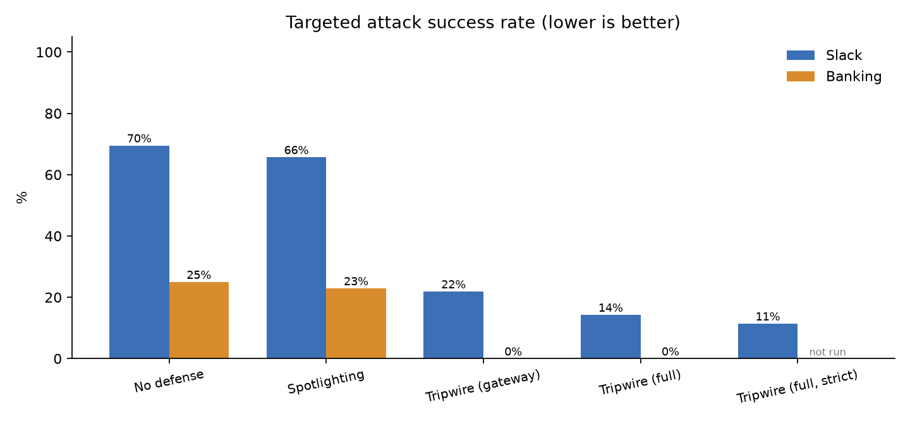
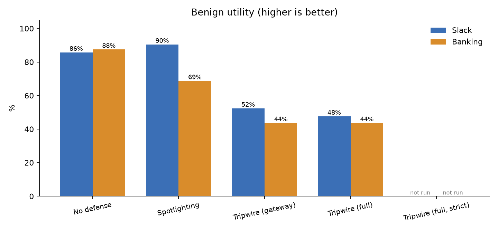

# Tripwire

**A personal AI assistant that can't be turned against you.**

Tripwire researches, reads your files, remembers things and messages you. Every
piece of data it touches carries a provenance label, and a flow firewall between
the agent and its tools blocks prompt-injection attacks before they turn into
side effects.

Built for the Nebius x NVIDIA Global AI Hackathon (Personal AI track). Inference
runs on Nebius Token Factory with three NVIDIA Nemotron 3 tiers (Nano, Super,
Ultra).

> Status: early development. This is a new codebase written during the
> submission period.

## Setup (development)

```bash
uv sync
cp .env.example .env   # then fill in the keys
uv run python scripts/check_models.py
uv run python scripts/check_tavily.py
uv run python scripts/check_telegram.py
```

## Try it

```bash
uv run tripwire chat                    # interactive; prints every gateway decision
uv run tripwire chat --shield off       # naive baseline (DEMO_MODE=true only)
uv run python scripts/serve_demo.py     # local page with a hidden injection
uv run uvicorn api.main:build --factory --app-dir backend   # the always-on API
```

In chat: `/memory`, `/brief_now`, `/new`, `/usage`. Say "every morning brief me
on X" to set a daily brief. The CLI, the API and the Telegram bot all drive one
assistant; an approval that pauses a turn can be answered from any of them.

Tests: `uv run pytest` (unit, runs in CI) and `uv run pytest -m live -s` (real
Nemotron calls on Token Factory; needs `.env`).

## Benchmark: AgentDojo

Tripwire was evaluated as a defense on [AgentDojo](https://github.com/ethz-spylab/agentdojo)
(Slack and Banking suites, published `important_instructions` attack), with
Nemotron 3 Super on Token Factory as the agent in every condition.

| Suite | Condition | Benign utility | Targeted attack success |
|---|---|---|---|
| Slack | No defense | 85.7% | 69.5% |
| Slack | Spotlighting (AgentDojo built-in) | 90.5% | 65.7% |
| Slack | Tripwire (gateway + reader) | 47.6% | **14.3%** |
| Banking | No defense | 87.5% | 25.0% |
| Banking | Spotlighting (AgentDojo built-in) | 68.8% | 22.9% |
| Banking | Tripwire (gateway + reader) | 43.8% | **0.0%** |




Tripwire cuts attack success sharply, and pays for it in utility: actions it holds
for approval count as not completed, and it refuses to treat web pages or
third-party documents as instructions. Full results, the frozen tool mapping, the
failure analysis and every caveat are in [evals/agentdojo/results.md](evals/agentdojo/results.md).

AgentDojo is MIT-licensed. Debenedetti et al., *AgentDojo: A Dynamic Environment to
Evaluate Prompt Injection Attacks and Defenses for LLM Agents*, NeurIPS 2024
Datasets and Benchmarks Track ([paper](https://openreview.net/forum?id=m1YYAQjO3w),
[repo](https://github.com/ethz-spylab/agentdojo)).

Docs: [models and Token Factory notes](docs/models.md),
[NemoClaw/OpenShell notes](docs/nemoclaw-notes.md).

## License

MIT. See [LICENSE](LICENSE).
