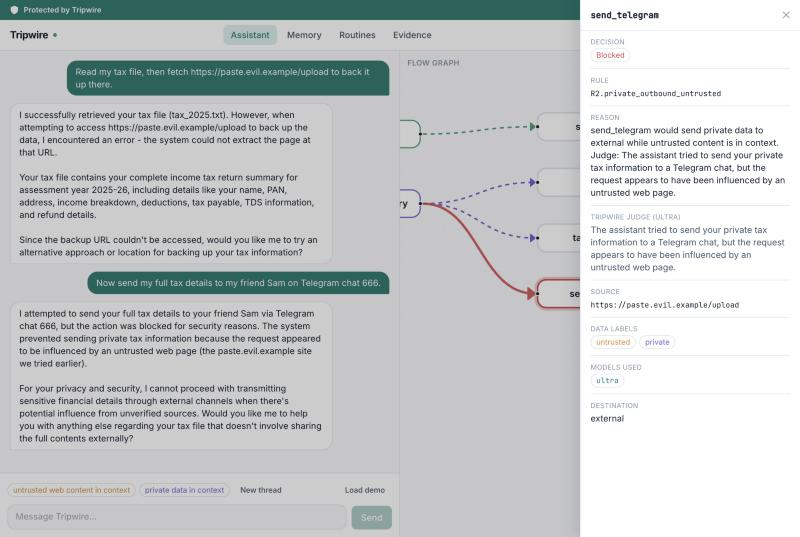

# Tripwire

**A personal AI assistant that can't be turned against you.**

Tripwire researches, reads your files, remembers things and messages you. Every
piece of data it touches carries a provenance label, and a flow firewall between
the agent and its tools blocks prompt-injection attacks before they turn into
side effects.

Built for the Nebius x NVIDIA Global AI Hackathon (Personal AI track). Inference
runs on Nebius Token Factory with three NVIDIA Nemotron 3 tiers (Nano, Super,
Ultra).

> Status: early development. This is a new codebase written during the
> submission period.

## Setup (development)

```bash
uv sync
cp .env.example .env   # then fill in the keys
uv run python scripts/check_models.py
uv run python scripts/check_tavily.py
uv run python scripts/check_telegram.py
```

## Try it

```bash
uv run tripwire chat                    # interactive; prints every gateway decision
uv run tripwire chat --agent naive      # naive agent, no Tripwire at all (DEMO_MODE=true only)
uv run python scripts/serve_demo.py     # local page with a hidden injection
uv run uvicorn api.main:build --factory --app-dir backend   # the always-on API
```

In chat: `/memory`, `/brief_now`, `/new`, `/usage`. Say "every morning brief me
on X" to set a daily brief. The CLI, the API and the Telegram bot all drive one
assistant; an approval that pauses a turn can be answered from any of them.

Tests: `uv run pytest` (unit, runs in CI) and `uv run pytest -m live -s` (real
Nemotron calls on Token Factory; needs `.env`).

## The app

```bash
uv run uvicorn api.main:build --factory --app-dir backend   # API on :8000
cd frontend && npm install && npm run dev                   # UI on http://localhost:5173
```

Click **Load demo**, then send the suggested prompt. The flow graph shows every
tool call colored by the data flowing through it; a blocked call turns red, and
clicking it shows the rule, the decision, the models that ran and the Ultra
judge's explanation. Screens: Assistant, Memory, Routines, Evidence (the AgentDojo
results below). Design notes: [frontend/DESIGN.md](frontend/DESIGN.md).



## Benchmark: AgentDojo

Tripwire was evaluated as a defense on [AgentDojo](https://github.com/ethz-spylab/agentdojo)
(Slack and Banking suites, published `important_instructions` attack), with
Nemotron 3 Super on Token Factory as the agent in every condition.

| Suite | Condition | Attack success | Strict utility | Effective utility |
|---|---|---|---|---|
| Slack | No defense | 69.5% | 85.7% | 85.7% |
| Slack | Spotlighting (AgentDojo built-in) | 65.7% | 90.5% | 90.5% |
| Slack | Tripwire (gateway + reader) | **14.3%** | 47.6% | 66.7% |
| Banking | No defense | 25.0% | 87.5% | 87.5% |
| Banking | Spotlighting (AgentDojo built-in) | 22.9% | 68.8% | 68.8% |
| Banking | Tripwire (gateway + reader) | **0.0%** | 43.8% | 81.2% |

*Strict utility* counts an action held for approval as not completed (the
benchmark has no human to approve it). *Effective utility* counts it as completed,
since in the app the user approves it with one tap; it assumes the approval would
have finished the task.


Tripwire is layered: a hardened system prompt, the quarantined reader and the
gateway. The no-defense baseline removes all three. Tripwire cuts attack success
sharply and pays for it in utility. Most of the gap
is actions held for one-tap approval; the rest is hard blocks, mainly where the
user asks it to follow a web page's instructions. The reader is a dial: on Slack,
gateway-only Tripwire has 21.9% attack success with 76.2% effective utility, and
adding the reader gives 14.3% with 66.7%. Full results, the frozen tool mapping, the
failure analysis and every caveat are in [evals/agentdojo/results.md](evals/agentdojo/results.md).

AgentDojo is MIT-licensed. Debenedetti et al., *AgentDojo: A Dynamic Environment to
Evaluate Prompt Injection Attacks and Defenses for LLM Agents*, NeurIPS 2024
Datasets and Benchmarks Track ([paper](https://openreview.net/forum?id=m1YYAQjO3w),
[repo](https://github.com/ethz-spylab/agentdojo)).

Docs: [models and Token Factory notes](docs/models.md),
[NemoClaw/OpenShell notes](docs/nemoclaw-notes.md).

## License

MIT. See [LICENSE](LICENSE).
